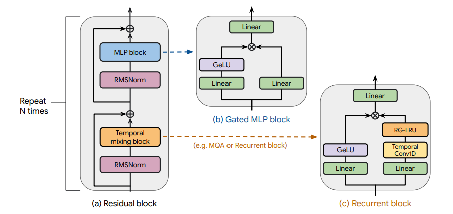

# Griffin & Hawk - a toy-scale build of a real-gated recurrence + local attention hybrid

A minimal implementation of the **RG-LRU** (Real-Gated Linear Recurrent
Unit) and the **Griffin** architecture, from De, Smith, Fernando, et al.
(Google DeepMind), *"[Griffin: Mixing Gated Linear Recurrences with Local
Attention for Efficient Language Models](https://arxiv.org/abs/2402.19427)"* (2024).

This is the first **hybrid** architecture in this repo: every other
recurrent-state notebook (KDA, GLA, RetNet, DeltaNet, Mamba, xLSTM)
replaces attention entirely. Griffin doesn't; it interleaves a gated
recurrence with occasional *local* (sliding-window) attention layers, on
the view that recurrence is good at compressing long-range history and
attention is good at precise short-range recall, and a model might as well
get both.

This README explains the idea in plain words. `griffin_mini.ipynb` builds
it, trains it on a toy dataset, and verifies it learns.

---

## 1. The RG-LRU: a *vector*-state recurrence

Every other gated recurrent layer in this repo (KDA, GLA, RetNet, DeltaNet,
xLSTM) keeps a **matrix** state, built from an outer product of a key and
a value, so it can associate specific keys with specific values, the way
attention does. The RG-LRU takes a simpler approach: its state is just a
**vector**, one number per channel, with no keys or values involved at all.
It's much closer to a classic gated exponential moving average than to
attention.

At every timestep, two gates are computed from the input:

- `r_t` (the **recurrence gate**) - controls how much this channel's decay
  rate should shift, per token.
- `i_t` (the **input gate**) - controls how much of the new input actually
  gets let in, independent of the recurrence gate.

These combine with a fixed, learned per-channel base decay `a` (in `(0,1)`)
to produce a per-token, per-channel effective decay:

```
a_t = a ^ (c * r_t)        # c is a constant (8 in the paper); r_t in (0,1) modulates how close a_t gets to 1
h_t = a_t * h_{t-1} + sqrt(1 - a_t^2) * (i_t * x_t)
```

The `sqrt(1 - a_t^2)` term is a **variance-preserving correction** —
without it, a channel with a decay close to 0 (fast forgetting) would
inject far more variance per step than a channel with decay close to 1
(slow forgetting), which makes training less stable across channels with
very different effective memory lengths. This rescales the new input's
contribution so the state's variance stays roughly constant regardless of
which decay rate a given channel happens to be using.

A full **Hawk block** (Griffin's purely-recurrent building block) wraps this
recurrence the same way Mamba wraps its SSM: project up into two branches,
run a short causal convolution + the RG-LRU on one branch, gate with a
SiLU-activated version of the other branch, project back down.

## 2. Griffin: interleaving RG-LRU with local attention

**Hawk** is the model you get from stacking Hawk blocks alone; no
attention anywhere. **Griffin** takes the same Hawk blocks and periodically
swaps some of them out for a **local (sliding-window) attention** block,
ordinary causal softmax attention, capped to only look back a fixed number
of tokens. The paper uses a repeating pattern of mostly-recurrent blocks
with attention mixed in periodically (this notebook uses 2 Hawk blocks for
every 1 local-attention block).

Why bother with attention at all, if the RG-LRU already handles long-range
information? The two mechanisms are good at different things:

- **RG-LRU** compresses the *entire* history into a fixed-size vector state
  — cheap and unbounded in context length, but lossy, since everything gets
  squeezed into the same fixed number of channels.
- **Local attention** gives *exact*, lossless recall of the last `window`
  tokens — nothing gets compressed or forgotten within that window, but it
  can't see anything further back.

Mixing the two gives a model that's cheap like a recurrent model over long
context, while still getting precise short-range recall where it matters
most.

<p align="center">
  
  <br>
  <em>The Main Backbone of the Architecture Overview</em>
</p>

## 3. What this notebook simplifies

The paper introduces custom, hardware-aware kernels for the RG-LRU
recurrence (a real-valued analogue of the complex-valued linear recurrent
unit from the earlier "LRU" paper, designed to run efficiently as an
associative scan on a TPU/GPU). This notebook uses the plain sequential
recurrence instead, a Python loop over timesteps — same as every other
recurrent layer in this repo.

## 4. Running it

Open `griffin_mini.ipynb` in Colab, run all cells top to bottom. `TinyLM`
builds the 2-Hawk-blocks-to-1-local-attention-block pattern by default
(Griffin's recipe); set `griffin=False` to build pure Hawk instead
(recurrent-only, no attention at all), for comparison. You'll see the model
built, sanity-checked, trained for 300 steps on a repeating
`"0123456789ABCDEF"` string, then used to generate.

## 5. Reference

De, Smith, Fernando, Botev, Cristian-Muraru, Gu, Haroun, Berrada, Chen,
Srinivasan, Desjardins, Doucet, Budden, Teh, Pascanu, De Freitas, Gulcehre,
*"[Griffin: Mixing Gated Linear Recurrences with Local Attention for
Efficient Language Models](https://arxiv.org/abs/2402.19427),"* 2024.
