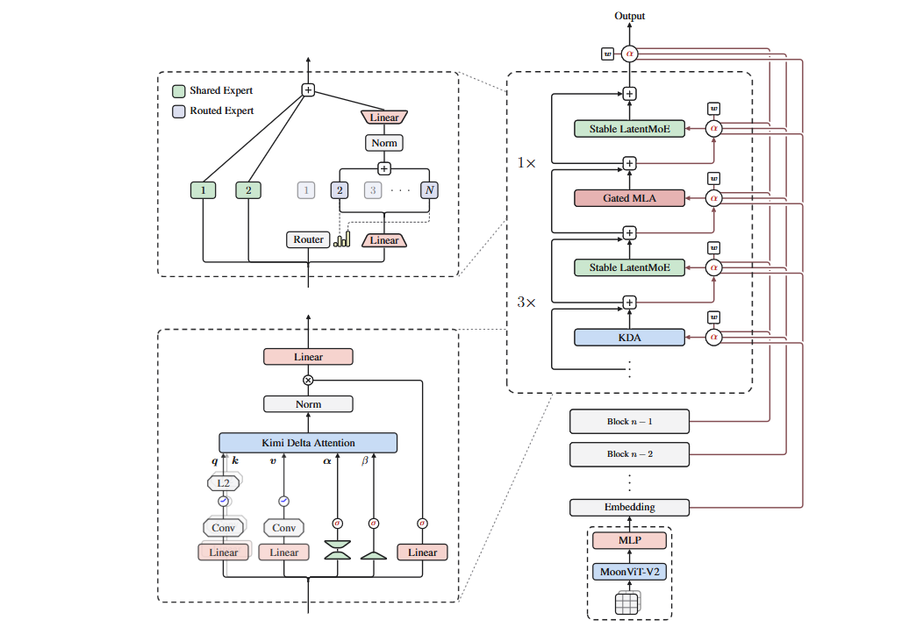

# Kimi Delta Attention (KDA)- a toy-scale build of Kimi K3

A minimal, readable implementation of the **Kimi K3** architecture from [**Kimi K3: Open Frontier Intelligence**](https://arxiv.org/pdf/2607.24653), built small enough to run on a free Colab GPU (or even CPU) and to be read top to bottom in on sitting.

This README explains **what each piece does and why it exists**, in plain
words, before you open the notebook. The notebook (`kimi_k3_mini.ipynb`) is
the same architecture built up cell by cell, trained on a toy dataset, and
sanity-checked.

---

## 1. The big picture

A Kimi K3 model is a stack of **blocks**. Each block contains four
sub-layers, always in the same order:

```
KDA → KDA → KDA → Gated MLA        (repeat this pattern per block)
```

So for every **3 linear-attention layers (KDA)**, there is **1 regular
softmax-attention layer (Gated MLA)**. Every one of those four sub-layers is
followed by its own feed-forward network, and that feed-forward network is a
**Mixture-of-Experts** (Stable LatentMoE) rather than a single dense MLP.

On top of that, instead of the usual residual connection (`x = x +
sublayer(x)`), K3 uses something called **Attention Residuals**: a small
learned attention mechanism decides, layer by layer, how much of *every
previous layer's output* (not just the immediately preceding one) should
flow into the current layer.

So the architecture has four ideas stacked together:

| piece | replaces | what it's for |
|---|---|---|
| **KDA** | normal self-attention | a linear-attention layer with a *forget gate*, so it can run in constant memory instead of storing a growing KV cache |
| **Gated MLA** | - | ordinary softmax attention, kept around every 4th layer so the model still has real, full-context attention somewhere |
| **Stable LatentMoE** | a normal MLP | a sparse feed-forward layer - only a few "expert" sub-networks fire per token, so capacity grows without every token paying for it |
| **Attention Residuals** | `x + sublayer(x)` | lets each layer pick and mix from *all* previous layers' outputs, not just the one right before it |

<p align="center">
  
  <br>
  <em>Kimi K3 Architecture Overview</em>
</p>


---
## 2. Kimi Delta Attention (KDA) - the core idea

### 2.1 Why not just use normal attention everywhere?

Normal (softmax) attention has to look back at *every* previous token to
compute the next one. That means the amount of memory it needs (the "KV
cache") grows with the length of the sequence. Fine for short text, painful
for very long context.

**Linear attention** fixes this by keeping a fixed-size running summary of
everything seen so far (a small matrix, called the **state**) and updating
it as new tokens come in, instead of storing every token individually.

### 2.2 The problem with plain linear attention: it never forgets

A plain linear-attention state just keeps *adding* new information forever.
Old information never fades, which means the state gets muddier and muddier
the longer the sequence runs.

KDA's fix: give the state a **forget gate**. At every step, before writing in
new information, the model first *decays* what's already stored. This is the
same idea as the forget gate in an LSTM, just written for a matrix-shaped
state instead of a vector.

### 2.3 What actually happens at every timestep

Think of the state `S` as a little scratchpad matrix that the model
carries forward and updates one token at a time. At each new token `t`:

1. **Decay the scratchpad.** Multiply the whole state by a decay value
   `alpha_t` (a number between 0 and 1, one *per channel*, not just one
   number for the whole matrix, this is the "channel-wise" part of KDA).
   A value close to 1 means "keep almost everything," close to 0 means
   "forget almost everything."
2. **Erase the part of the scratchpad related to the current key**, scaled
   by a learned strength `beta_t`. This is the "delta rule" part: instead of
   blindly writing new information on top of old, the model first removes
   whatever it previously wrote for a similar key.
3. **Write the new value** in, again scaled by `beta_t`.
4. **Read out** an output by querying the freshly updated scratchpad with
   the current query vector.

In the code, steps 1–4 are exactly the four lines inside the `for t in
range(T):` loop of the `KDA` class, each one is tagged with the equation
number it implements.

### 2.4 Where the decay values come from

The per-channel decay `alpha_t` isn't a fixed number, it's *predicted from
the input itself* through a small bottleneck (`alpha_down` → `alpha_up`),
squashed into a safe range with a sigmoid, and floored at a minimum value
(`gmin`) so the state can't decay to exactly zero and lose everything
instantly. This is what makes KDA "selective". It can decide, per token and
per channel, how much of the past is still relevant.

### 2.5 Before and after the recurrence

- **Short convolution**: queries, keys, and values are each passed through a
  small causal convolution before entering the recurrence. This lets nearby
  tokens mix locally before the long-range recurrence takes over, similar
  in spirit to why Mamba uses a short conv too.
- **Output gate**: after reading the output from the state, it's multiplied
  by a learned sigmoid gate. This lets the layer suppress parts of its own
  output on a per-token basis before adding it back into the residual
  stream.

### 2.6 What this notebook simplifies

The real KDA layer is implemented with a **chunkwise-parallel** algorithm. 
It processes the sequence in chunks using matrix multiplications, which is
what makes it fast on a GPU. This notebook instead implements the plain
**sequential recurrence**, a Python `for` loop over every timestep.

- Same math, same result.
- Much slower (that's fine, the sequences here are tiny).
- Much easier to read, because you can watch the state update one token at a
  time instead of reasoning about a batched chunk algorithm.

To know more about the Kimi Delta Attention, it is suggested to read the [**Kimi Linear: An Expressive, Efficient Attention Architecture**](https://arxiv.org/pdf/2510.26692) paper.

---

## 3. Gated MLA - the "normal attention" layer

Every 4th layer, K3 steps back and uses regular softmax attention instead of
linear attention. Two things are worth noting:

- **No positional encoding (NoPE).** No RoPE, no learned position
  embeddings. The model relies entirely on the KDA layers and the causal
  mask for positional information.
- **Output gate.** Just like KDA, the output of the attention is multiplied
  by a learned sigmoid gate before being projected back down. This output-gating pattern
  shows up everywhere in K3, not just in KDA.

The real architecture also compresses keys and values into a small latent
vector before the attention (that's the "Latent" in Multi-head Latent
Attention) purely to shrink the KV cache in production serving. This
notebook skips that as it doesn't change what the layer *computes*, only how
cheaply it stores its cache, so it's a fair thing to drop at toy scale.

---

## 4. Stable LatentMoE - the feed-forward layer

Instead of one big MLP after every attention layer, K3 uses a
**Mixture-of-Experts** feed-forward network. Two kinds of experts run in
parallel:

- **Shared experts** - a small number of experts that process *every*
  token, no routing involved. These act as a stable, always-on baseline.
- **Routed experts** - a larger pool of experts where each token is only
  sent to its **top-k** highest-scoring experts (decided by a small router
  network). Different tokens can activate different experts.

The result is added together: `output = shared_output + routed_output`.

The routed side also has two "stability" tricks:

- Routed experts operate in a **compressed latent space** (project down,
  run the expert, project back up), which keeps their cost small even with
  many of them.
- A **SiTU-GLU** activation (a smoothly-clipped variant of a gated linear
  unit) is used instead of a plain SwiGLU for the routed experts, plus an
  RMSNorm right before the final up-projection, both are there to keep
  training numerically stable when a lot of experts are stacked.

### What this notebook simplifies

- **Routing**: the real system uses "Quantile Balancing" to keep expert
  load even across a batch. This notebook uses plain top-k routing with no
  load-balancing trick.
- **Sparse dispatch**: in a real system, only the tokens routed to an expert
  are sent to it (sparse compute). Here, *every* expert processes *every*
  token, and the unused ones are just multiplied by zero afterward. Same
  result, much less code, more FLOPs,  a completely fair trade at this
  scale.

---

## 5. Attention Residuals - rethinking the residual stream

Normally, a transformer layer does:

```
x = x + sublayer(x)
```

which only ever looks at *the immediately preceding layer's output*. K3
replaces this with a small attention mechanism: at layer `l`, it looks back
at *every* previous layer's output (plus the original embedding) and
combines them with **learned attention weights** instead of just adding the
last one.

Concretely, each layer has a learned "pseudo-query" vector. That
pseudo-query is compared against all previous layer outputs (normalized
first), turned into attention weights with a softmax, and used to compute a
weighted mixture of all previous outputs. That mixture what gets fed into the current layer.

Intuitively: instead of forcing information to pass through every single
layer in a fixed chain, the model gets to choose, per layer, which earlier
layers' outputs are actually useful right now.

To know more about the work, it is suggested to check the [**Attention Residuals**](https://arxiv.org/pdf/2603.15031) paper.

### What this notebook simplifies

The paper describes both a **Full** form (attend over *all* previous layers)
and a **Block-partitioned** form (only attend within nearby blocks, for
efficiency at large depth). This notebook only has a handful of layers, so
there's no need to partition as it uses the Full form directly, which is
exact, just not the version you'd want at real depth.

---

## 6. What's fully left out

- **MoonViT (the vision pathway)** - K3's native image/video input path.
  Left out entirely to keep this a text-only toy model.
- **Multi-Token Prediction (MTP) head** - an auxiliary head that predicts
  more than one future token at once during training. Left out for
  simplicity.
- **Quantization** - irrelevant at toy scale.

---

## 7. Running the notebook

Open `kimi_k3_mini.ipynb` in Google Colab (GPU not required, but speeds up
training). Run all cells top to bottom. You'll see, in order:

1. The model get built and its parameter count printed.
2. A **sanity check** - one forward + backward pass, checking output shape
   and confirming no gradient is `NaN`.
3. A short **training loop** on a synthetic periodic string
   (`"0123456789ABCDEF"` repeated), which exists purely to prove that
   gradients flow correctly through every custom piece above - KDA's
   recurrence, the MoE routing, and the Attention Residuals.
4. **Generation** - sampling new tokens from the trained toy model. If
   training worked, you should see visible periodicity in the output.

## 8. Reference
1. Kimi Team, [*Kimi K3: Open Frontier Intelligence*](https://arxiv.org/pdf/2607.24653), 2026. Section and equation numbers referenced throughout the code comments correspond to this report, read the code and the report side by side.
2. Kimi Team, [*Attention Residuals*](https://arxiv.org/pdf/2603.15031), 2026.
3. Kimi Team, [*Kimi Linear: An Expressive, Efficient Attention Architecture*](https://arxiv.org/pdf/2510.26692), 2025. 
